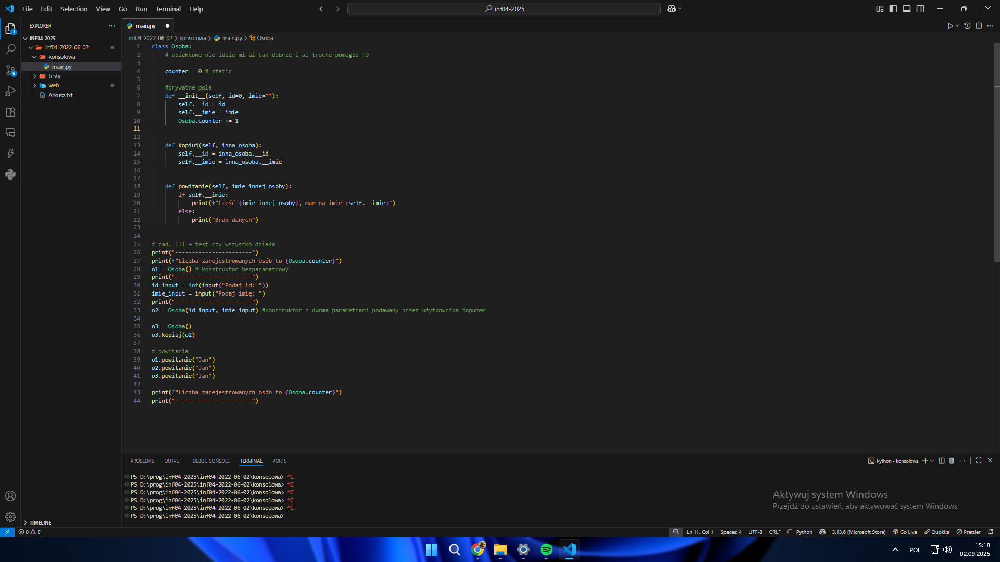
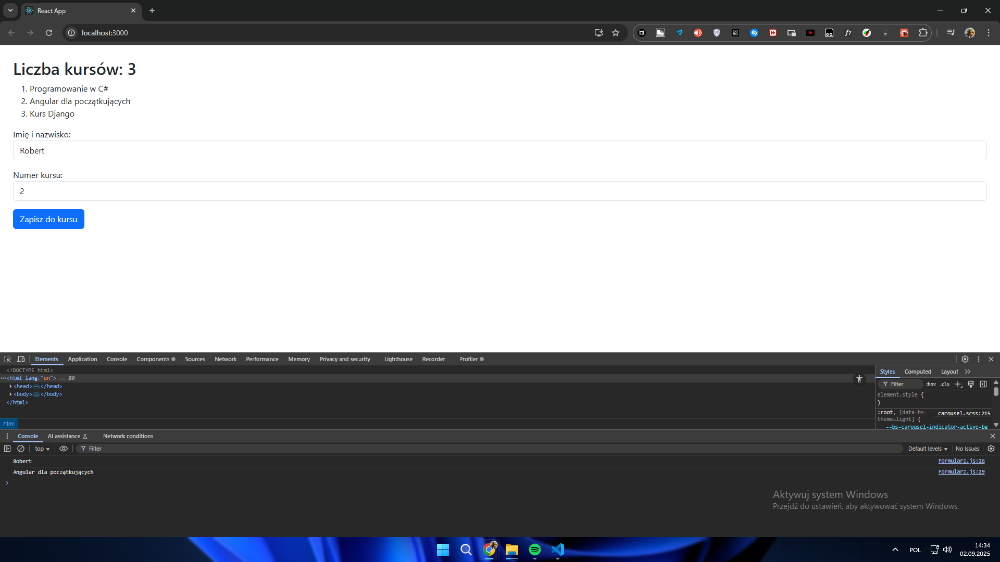

# inf04-2025-2026
Plik z wszystkimi plikami do inf04.

*Egzaminy Praktyczne do egzaminu inf04*
*Są to egzaminy rozwiązane **(przeze mnie)**, i w folderze znajdują się linki do **Arkuszy***

# Przykładowe Screeny z Egzaminów
(Arkusz INF.04 : 2022 - czerwiec - zad. 02)
----- Python / JavaScript, JSX, React, Bootstrap -----

# 
Python (konsolowa)

# 
React + JS (Aplikacja Webowa)

*credits:* [ja](https://www.github.com/Marmo77)
